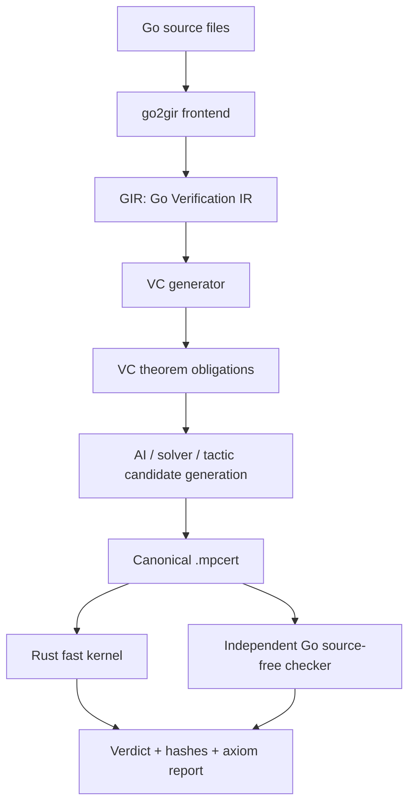

# Architecture

Migration note: the architecture and repository layout below describe the
current pre-cutover Go/GIR release. They remain current, not historical, until
the atomic cutover owned by `05_rust_frontend_design-todo.md`. The staged
language-neutral design in `05_rust_frontend_design.md` must not be partially
activated, and it does not change Certificate v0 or proof acceptance.

## System overview



## Repository layout

```text
mpk/
  crates/
    mpk-core/          # term, level, declaration, context, reduction, defeq
    mpk-cert/          # canonical certificate encoding, decoding, hashing
    mpk-kernel/        # fast Rust verifier
    mpk-cli/           # command-line interface
    mpk-api/           # untrusted AI/tooling API
    mpk-vc/            # GIR importer, contract-to-obligation adapter, and VC builder
  go-tools/
    go2gir/            # Go source -> GIR using go/packages and go/ssa
    mpk-checker-ref/   # independent clean-room source-free reference checker
  specs/
    CORE_V0.md
    CERT_V0.md
    GIR_V0.md
    GO_SUBSET_V0.md
    TRUST_BOUNDARY_V0.md
    AXIOM_POLICY_V0.md
    UNSAFE_POLICY_V0.md
    AI_API_V0.md
  proofs/
    std/
    go/
  fixtures/
    cert-basic/
    go-basic/
    go-vc/
  scripts/
    check-fast.sh
    check-reference.sh
    check-all.sh
```

## Trust levels

### Level 0: core theorem mode

A certificate proves only the theorem statement encoded in the certificate. No claim is made about the original Go source.

### Level 1: Go verification artifact mode

A bundle includes:

- Go source file hashes;
- Go toolchain version;
- `go2gir` binary hash;
- GIR hash;
- VC hash;
- certificate hash;
- fast-kernel verdict;
- reference-checker verdict;
- axiom report hash.

This supports engineering traceability, but the Go frontend remains outside the mathematical trusted base.

### Level 2: future verified frontend mode

A later version may verify a narrow Go subset decoder and GIR semantics, moving part of the frontend into a checked chain. This is explicitly out of MVP scope.

## Main data artifacts

| Artifact | Role | Trusted? |
|---|---|---|
| Go source | User code | No |
| Contract JSON | User specification | No, except as encoded theorem statement |
| GIR | Verification IR | No |
| VC file | Theorem obligations | No, until encoded in certificate |
| AI trace | Candidate-generation evidence | No |
| Solver output | Candidate-generation evidence | No |
| Solver certificate | Checkable evidence if kernel verifies it | Yes, only after check |
| `.mpcert` | Canonical proof artifact | Yes |
| Export hash | Public interface identity | Yes |
| Axiom report | Trusted dependency disclosure | Yes when recomputed |
| Source map | Debugging | No |

## Why Go first

Go is a good first source language because the Go ecosystem provides parser, type-checker, package-loading, analysis, and SSA tooling. However, MPK should treat all frontend output as untrusted and should avoid unsupported language features by failing closed.

## High-level module boundaries

### `mpk-core`

Owns:

- universe levels;
- terms;
- declarations;
- local contexts;
- substitution and lifting;
- weak-head normalization;
- definitional equality;
- core type inference/checking;
- inductive positivity and recursor checks for MVP inductives.

### `mpk-cert`

Owns:

- canonical binary encoder/decoder;
- certificate schema validation;
- hash-domain separation;
- export block generation;
- axiom report generation;
- import resolution policy;
- high-trust import mode.

### `mpk-kernel`

Owns:

- fast verification orchestration;
- checker cache management;
- deterministic structured errors;
- no dependency on source frontend, tactic engine, or AI layer.

### `mpk-checker-ref`

Owns:

- independent source-free checker implementation;
- clean-room decoder and semantic checker;
- stricter code-style constraints;
- no shared kernel implementation code.

### `go2gir`

Owns:

- Go package loading;
- SSA extraction;
- Go subset rejection;
- `mpk.go.contract.v0` sidecar loading and schema validation;
- GIR emission;
- source manifest generation;
- no trusted proof semantics.

### `mpk-vc`

Owns:

- GIR-to-core model encoding;
- weakest-precondition or symbolic-execution VC generation;
- loop-invariant obligations and optional total-correctness variant obligations;
- theorem-obligation output;
- no trusted proof acceptance.

### `mpk-api`

Owns:

- proof-node construction API;
- candidate checking loops;
- structured diagnostics for AI;
- cacheable subgoal sessions;
- no certificate acceptance without kernel check.
